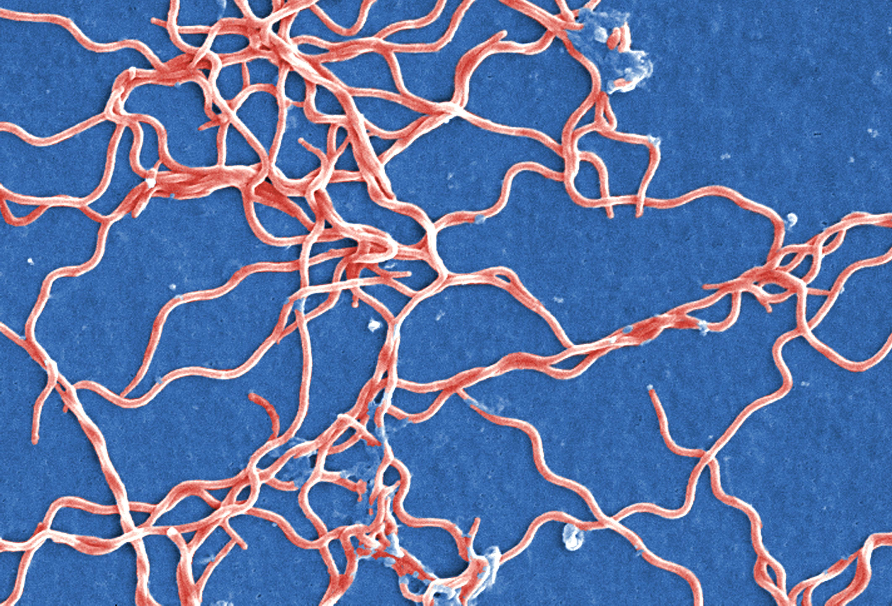

1. Load package
```{r}
library(dplyr)
library(knitr)
library(ggplot2)
```

2. Importing data
```{r import data}
MyData<-read.csv("Sequences.csv", header=FALSE) 

names(MyData) #Check column names
```


3. Clean up data frame: PART 1
```{r}
dat1<-MyData %>% 
  filter(grepl('2|3|4',V1)) %>% #Search V1 column for integers 2, 3 or 4 (share the rows containing the individual sequence for each strain) and filter only those specific rows
  
  rename("I.D"=V1, "Strain"=V2) #Rename columns 
```

4. Extract ONLY the sequence
```{r}
#Remove the header information for each strain's sequence; make new object for each
Header1<-gsub(".*sequence","", dat1$Strain[1]) 
Header2<-gsub(".*sequence","", dat1$Strain[2]) 
Header3<-gsub(".*sequence","", dat1$Strain[3]) 

#Remove all new line characters for each strain's sequence; make new object for each
Strain1<-gsub("[\n]+","", Header1) 
Strain2<-gsub("[\n]+","", Header2) 
Strain3<-gsub("[\n]+","", Header3) 
```

5. Clean up data frame: PART 2
```{r}
dat1$I.D <- c("HQ433692.1","HQ433694.1","HQ433691.1") #Add I.D names for each strain
dat1$Strain <- c("QLZP1","CS4","GL18") #Add strain names 
dat1$Sequence <- c(Strain1, Strain2, Strain3) #Make new column containing just the sequence for each strain
```


6. Calculations for number of each nucleotide 
```{r}
#Make a new column for each nucleotide containing the number of each nucleotide within the sequence for each strain
#The Gregexpr function provides a list of matches and the length of this list essentially tells us the number of occurrences of a specified character/pattern, specifically in our case; G, C, A and T 
#The sapply function essentially applies the function 'length' to the results of the gregexpr function which will gives us the number of occurrences of each nucleotide for each strain 

dat1$Number_of_G<- sapply(gregexpr("G", dat1$Sequence), length)
dat1$Number_of_C<- sapply(gregexpr("C", dat1$Sequence), length)
dat1$Number_of_A<- sapply(gregexpr("A", dat1$Sequence), length)
dat1$Number_of_T<- sapply(gregexpr("T", dat1$Sequence), length)

#Create a new dataset with new columns containing Total base pairs and GC % content 
dat2<-mutate(dat1, TotalBP=Number_of_G + Number_of_C + Number_of_A + Number_of_T, 
       GC_Content =round(((Number_of_G + Number_of_C)/TotalBP)*100,2)) #Round up

dat2
```

7. Making tables
```{r}
#A table for the number of each nucleotide for each of the three sequences
Table1<-dat2 %>%
  select(I.D, Strain, Guanine=Number_of_G, Cytosine=Number_of_C, Adenine=Number_of_A, Thymine=Number_of_T, Total=TotalBP)

#A table for the GC content
Table2<-dat2 %>%
  select(I.D, "% GC Content"=GC_Content)
```
#Number of each Nucleotide 
```{r}
kable(Table1, caption = "Summary Table 1")
```

#% GC Content 
```{r}
kable(Table2, caption = "Summary Table 2")
```

#DNA sequences for 16S gene of *Borrelia burgdorferi*
   
###HQ433694.1
```{r}
print(dat1$Sequence[1])
print(filter(Table1, I.D=="HQ433692.1"))
```

###HQ433692.1
```{r}
print(dat1$Sequence[2])
print(filter(Table1, I.D=="HQ433694.1"))
```

###HQ433691.1
```{r}
print(dat1$Sequence[3])
print(filter(Table1, I.D=="HQ433691.1"))
```

#Image of *Borrelia burgdorferi*


[Image source](https://mechpath.com/2015/12/01/borrelia-burgdorferi/)

[More Information - Wikipedia](https://en.wikipedia.org/wiki/Borrelia_burgdorferi)

#Scatterplot of %GC

```{r}
MyData2<-read.csv("GC_content.csv") #Import dataset
MyData2$GC_content<-MyData2$G + MyData2$C #Add new column for GC content %


qplot(Species,GC_content,data=MyData2, colour=Species, size=I(5),alpha=I(0.2), xlab="Species", ylab="%GC", main="%GC Content of Species from 1000 Specimens") + theme_classic() #Difficult to distinguish between points within each species

qplot(ID,GC_content,data=MyData2,colour=Species, xlab="ID", ylab="%GC", main="%GC Content of Species from 1000 Specimens")+ theme_classic() #Less overlap of points within species
```


